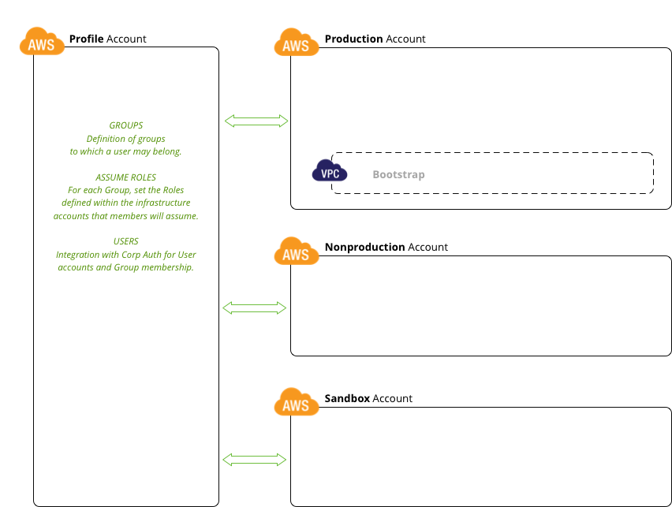

##### Security Model

###### Dependencies

1. Setup four AWS accounts for the following uses:

    Infrastructure Accounts.
    
    Account 1: production
    Account 2: nonproduction
    Account 3: sandbox
    
    Account 4: IAM User auth integration and group membership.
    
    The general pattern follows the security principles outlined by [Moritz Heiber](https://www.thoughtworks.com/insights/blog/using-aws-security-first-class-citizen).
    Roles are defined within the infrastructure accounts to define level of access
    required by specific users or service accounts. Within the IAM or 'profile'
    account, the automated configuration management adds users to groups that
    map to these roles. Users can then assume roles to perform infrastructure
    related tasks and service accounts can have the necessary permission to enable
    the automated management of the entire platform.
    
    
    
    Account 4 is used as a the master account for an [AWS Organization](http://docs.aws.amazon.com/organizations/latest/userguide/orgs_introduction.html).
    
    
    
